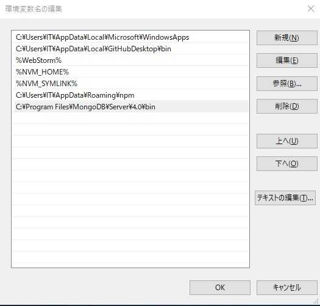
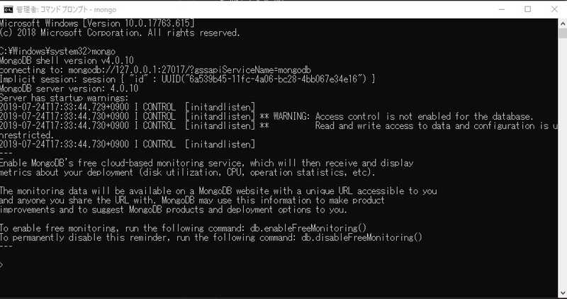
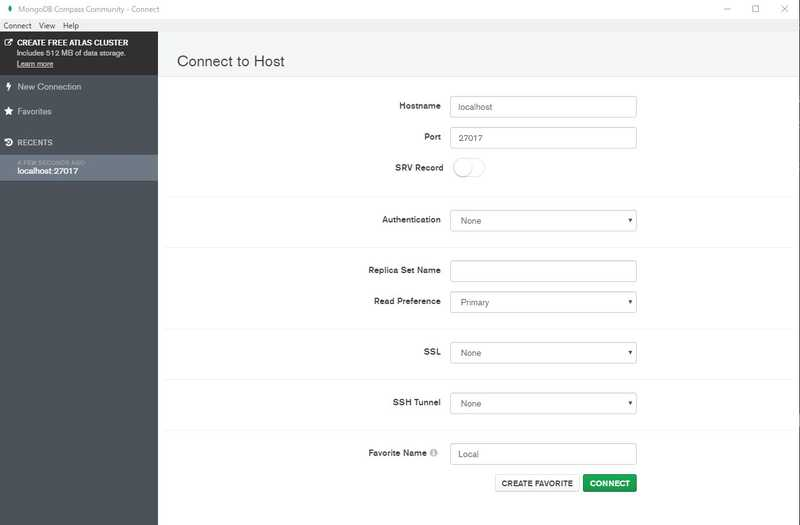

##まえがき
※初記事です。
4年間プラグイン開発をしていた経験を活かして様々な知識を提供出来たらと思います

##概要
今回はKotlinでMongoDBを使ったプラグインの開発手法を解説したいと思います

「プラグイン開発経験がある方」や「これからやってみたいという方」などを対象にした記事なので是非気軽に読んでみてください！

もちろん「Javaで書いたことはあるけどKotlinで書いたことがない」という方々にもおすすめの言語で

##開発環境
* Language: Kotlin
* Editor: JetBrains Intellij IDEA (Ultimate)
* JDK: 1.8.0_201
* Framework: Maven
* Spigot: 1.14.1-R0.1-SNAPSHOT
* OS: Windows 10 (64bit)
* MongoDB: 4.0

##今回の目的
* ローカルでMongoDBを扱うための開発環境を整える

##1. MongoDBをインストールする
環境にあったものを選んでください　インストーラー(msi)を推奨します https://www.mongodb.com/download-center/community

##2. 環境変数への登録
コマンド操作があるのでインストールフォルダにパスを通しておきましょう\
C:\Program Files\MongoDB\Server\4.0\bin

##3. 試しにコマンドを叩いてみる
このように表示されたら環境変数登録は成功です

##4. インストール時についてきたMongoDB Compassを開いてみる
これが純正のGUI CRUDツールですね。データベースのドキュメント操作などができる。便利すぎる。

##今回はここまで
次回からコーディングに入る予定です
ご不明な点がございましたらコメントでお聞きください。
