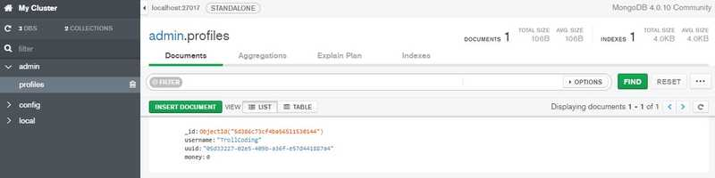

前回に引き続き「MongoDBを使ったKotlin製プラグイン開発」です

[MongoDBを使ったKotlin製プラグイン開発 ②](https://trollcoding.me/MongoBukkitTutorial-2/) の続きです

##開発環境
* Language: Kotlin
* Editor: JetBrains Intellij IDEA (Ultimate)
* JDK: 1.8.0_201
* Framework: Maven
* Spigot: 1.14.1-R0.1-SNAPSHOT
* OS: Windows 10 (64bit)
* MongoDB: 4.0

##今回の目的
* MongoDBに任意の数値をプレイヤーのUUIDごとに保存したり、それを取得したりする
* 所持金要素を実装する

##1. パッケージ構成
    MongoTutorialPlugin                                
    ├─ lib                                             
    │   └─ spigot-1.14.1.jar                          
    │   
    ├─ src                                             
    │   ├─ main                                        
    │   │   ├─ kotlin                                  
    │   │   │   └─ me                                 
    │   │   │       └─ trollcoding                     
    │   │   │           └─ mongotutorial               
    │   │   │               ├─ command                 
    │   │   │               │   └─ MoneyCommand.kt     
    │   │   │               │   
    │   │   │               ├─ listener                
    │   │   │               │   └─ PlayerListener.kt   
    │   │   │               │   
    │   │   │               ├─ mongo                  
    │   │   │               │   ├─ MongoSecret.kt      
    │   │   │               │   └─ TutorialMongo.kt    
    │   │   │               │   
    │   │   │               ├─ data                  
    │   │   │               │   └─ Profile.kt        
    │   │   │               │   
    │   │   │               └─ TutorialPlugin.kt      
    │   │   │               
    │   │   └─ resources                               
    │   │       └─ plugin.yml                          
    │   │       
    │   └─ test                                        
    │       └─ kotlin                                  
    │           └─ me                                  
    │               └─ trollcoding                     
    │                   └─ mongotutorial               
    │                       
    └─ pom.xml              

##2. クラスを書いていこう

今回はコマンドを実装するのでコマンドを記入

<details><summary>plugin.yml</summary><div>

```yaml
name: MongoTutorialPlugin
main: me.trollcoding.mongotutorial.TutorialPlugin
version: 1.0
commands:
  money:
```

</div></details>

##メインクラス
前回との変更点は、※1, 2のみ

<details><summary>TutorialPlugin.kt</summary><div>

```kotlin
package me.trollcoding.mongotutorial

import me.trollcoding.mongotutorial.command.MoneyCommand
import me.trollcoding.mongotutorial.listener.PlayerListener
import me.trollcoding.mongotutorial.mongo.MongoSecret
import me.trollcoding.mongotutorial.mongo.TutorialMongo
import org.bukkit.Bukkit
import org.bukkit.plugin.java.JavaPlugin

class TutorialPlugin : JavaPlugin() {

    companion object {
        //インスタンス宣言
        lateinit var instance: TutorialPlugin
    }

    //接続用オブジェクト
    lateinit var mongo: TutorialMongo

    override fun onEnable() {
        instance = this

        //接続
        mongo = TutorialMongo(
            MongoSecret.HOST,
            MongoSecret.PORT,
            MongoSecret.DATABASE_NAME,
            MongoSecret.USERNAME,
            MongoSecret.PASSWORD
        )
        
        //※1 コマンド登録
        this.getCommand("money")!!.setExecutor(MoneyCommand())
        
        //※2 リスナー登録
        Bukkit.getPluginManager().registerEvents(PlayerListener(this), this)
    }

    override fun onDisable() {
        //接続終了
        mongo.client.close()
    }
}
```

</div></details>

##MongoDBから取得したプレイヤーデータの保持、更新などをするクラス

<details><summary>Profile.kt</summary><div>

```kotlin
package me.trollcoding.mongotutorial.data

import com.mongodb.client.model.Filters
import com.mongodb.client.model.ReplaceOptions
import me.trollcoding.mongotutorial.TutorialPlugin
import org.bson.Document
import org.bukkit.Bukkit
import org.bukkit.entity.Player
import java.util.*

/**
 * @param uuid プレイヤーのUUID
 * @param username プレイヤーのユーザー名
 *
 */
class Profile(var username: String?, var uuid: UUID?) {

    //所持金
    var money: Int = 0

    //ロードが完了してるか
    var loaded: Boolean = false

    init {
        load()
    }

    companion object {
        //生成したProfileオブジェクトをUUID毎に保存する
        val profiles = HashMap<UUID, Profile>()

        /**
         * UUIDから取得
         */
        fun getByUuid(uuid: UUID): Profile {
            return if (profiles.containsKey(uuid)) {
                profiles[uuid]!!
            } else Profile(null, uuid)
        }
    }

    /**
     * UUIDからプレイヤーを返す
     */
    fun toPlayer() : Player {
        return Bukkit.getPlayer(uuid!!)!!
    }

    /**
     * ロード
     */
    fun load() {
        //プレイヤーデータ保存用ドキュメントからUUIDでマッチするドキュメントを取り出す
        val document = TutorialPlugin.instance.mongo.profiles.find(Filters.eq("uuid", uuid.toString())).first()

        if (document != null) {
            if (username == null) {
                username = document.getString("username")
            }

            money = document.getInteger("money")
        }

        loaded = true
    }

    /**
     * セーブ
     */
    fun save() {
        val document = Document()
        document["username"] = username
        document["uuid"] = uuid.toString()
        document["money"] = money

        //MongoDBのプレイヤーデータ保存用ドキュメントに格納
        TutorialPlugin.instance.mongo.profiles.replaceOne(Filters.eq("uuid", uuid.toString()), document, ReplaceOptions().upsert(true))
    }

    /**
     * 所持金の値を更新
     */
    private fun updateMoney(to: Int) {
        this.money = to
        save()
    }

    /**
     * 所持金を増やす
     */
    fun increaseMoney(amount: Int) {

        var calc = money + amount

        /* 上限オーバーだったら */
        if (amount >= Integer.MAX_VALUE) {
            calc = Integer.MAX_VALUE
        }

        updateMoney(calc)

        arrayOf(
            "あなたの所持金が ${amount}円 増えました",
            "現在の所持金額: ${money}円"
        ).forEach { msg -> toPlayer().sendMessage(msg) }

        save()
    }

    /**
     * 所持金を減らす
     */
    fun decreaseMoney(amount: Int) {

        var calc = money - amount

        /* マイナスだったら */
        if (calc < 0) {
            calc = 0
        }

        updateMoney(calc)

        arrayOf(
            "あなたの所持金が ${amount}円 減りました",
            "現在の所持金額: ${money}円"
        ).forEach { msg -> toPlayer().sendMessage(msg) }

        save()
    }

}
```

</div></details>

##リスナーを実装する

<details><summary>PlayerListener.kt</summary><div>

```kotlin
package me.trollcoding.mongotutorial.listener

import me.trollcoding.mongotutorial.TutorialPlugin
import me.trollcoding.mongotutorial.data.Profile
import org.bukkit.Bukkit
import org.bukkit.event.EventHandler
import org.bukkit.event.Listener
import org.bukkit.event.player.AsyncPlayerPreLoginEvent
import org.bukkit.event.player.PlayerQuitEvent
import org.bukkit.scheduler.BukkitRunnable

class PlayerListener(val instance: TutorialPlugin) : Listener {

    @EventHandler
    fun onAsyncPlayerPreLogin(event: AsyncPlayerPreLoginEvent) {

        event.apply {

            val player = Bukkit.getPlayer(event.uniqueId)

            if (player != null && player.isOnline) {
                val message = "既に同じプレイヤーがログイン済みです"
                event.apply {
                    loginResult = AsyncPlayerPreLoginEvent.Result.KICK_OTHER
                    kickMessage = message
                }
                instance.server.scheduler.runTask(instance, Runnable { player.kickPlayer(message) })
                return
            }

            var profile: Profile? = null

            try {
                profile = Profile(event.name, event.uniqueId)

                if (!profile.loaded) {
                    event.loginResult = AsyncPlayerPreLoginEvent.Result.KICK_OTHER
                    event.kickMessage = "プレイヤーデータの取得に失敗しました"
                    return
                }

                profile.username = event.name
                profile.save()

            } catch (e: Exception) {
                e.printStackTrace()
                instance.logger.severe("例外エラー: " + event.name + "のプレイヤーデータ取得に失敗")
            }


            if (profile == null || !profile.loaded) {
                event.kickMessage = "プレイヤーデータの取得に失敗しました"
                event.loginResult = AsyncPlayerPreLoginEvent.Result.KICK_OTHER
                return
            }

            //プレイヤーデータ格納
            Profile.profiles[profile.uuid!!] = profile
        }
    }

    @EventHandler
    fun onPlayerQuit(event: PlayerQuitEvent) {
        event.apply {
            player.apply {
                if (Profile.profiles[uniqueId] != null) {
                    val profile = Profile.profiles.remove(uniqueId)
                    if (profile!!.loaded) {
                        object : BukkitRunnable() {
                            override fun run() {
                                try {
                                    profile.save()
                                } catch (e: Exception) {
                                    instance.logger.severe("プレイヤーデータの保存に失敗: $name")
                                }

                            }
                        }.runTaskAsynchronously(instance)
                    }
                }
            }
        }
    }
}
```

</div></details>

##自分の所持金を操作できるコマンドを実装する

<details><summary>MoneyCommand.kt</summary><div>

```kotlin
package me.trollcoding.mongotutorial.command

import me.trollcoding.mongotutorial.data.Profile
import org.bukkit.command.Command
import org.bukkit.command.CommandExecutor
import org.bukkit.command.CommandSender
import org.bukkit.entity.Player

class MoneyCommand : CommandExecutor  {

    val commands = arrayOf(
        "/money", 
        "/money add <amount>",
        "/money remove <amount>"
    )

    override fun onCommand(sender: CommandSender, cmd: Command, 
                           label: String, args: Array<out String>): Boolean {
        sender.apply {

            if (sender !is Player) {
                sendMessage("プレイヤーが実行してください")
                return true
            }

            Profile.getByUuid(sender.uniqueId).apply {

                if (args.isEmpty()) {

                    sendMessage("現在の所持金額: ${money}円")

                } else if (args.size == 2) {

                    var amount = 0

                    args[0].apply {

                        if (equals("add", true) ||
                            equals("remove", true)) {
                            try {
                                amount = Integer.parseInt(args[1])
                            } catch (e: NumberFormatException) {
                                sendMessage("整数で入力してください")
                                return true
                            }
                        }

                        when {
                            equals("add", true) -> increaseMoney(amount)
                            equals("remove", true) -> decreaseMoney(amount)
                            else -> commands.forEach { command -> sendMessage(command) }
                        }
                    }
                }
            }
        }
        return true
    }
}
```

</div></details>

##5. デバッグしてみる

MongoDBのドキュメントはこんな感じ


コマンドを呼び出してみる


こんな感じに動けばOKです

##これで完成です
ご不明な点がございましたらコメントでお聞きください。
