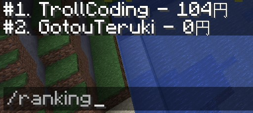

[MongoDBを使ったKotlin製プラグイン開発 ③](https://trollcoding.me/MongoBukkitTutorial-3/) の続きです

##開発環境
* Language: Kotlin
* Editor: JetBrains Intellij IDEA (Ultimate)
* JDK: 1.8.0_201
* Framework: Maven
* Spigot: 1.14.1-R0.1-SNAPSHOT
* OS: Windows 10 (64bit)
* MongoDB: 4.0

##今回の目的
* MongoDBの降順ソートを利用してランキング機能を実装する

##1. パッケージ構成
    MongoTutorialPlugin                               
    ├─ lib                                             
    │   └─ spigot-1.14.1.jar                           
    │   
    ├─ src                                            
    │   └─ main                                       
    │       ├─ kotlin                                 
    │       │   └─ me                                 
    │       │       └─ trollcoding                    
    │       │           └─ mongotutorial              
    │       │               ├─ command                
    │       │               │   ├─ MoneyCommand.kt    
    │       │               │   └─ RankingCommand.kt  
    │       │               │   
    │       │               ├─ data                   
    │       │               │   └─ Profile.kt          
    │       │               │   
    │       │               ├─ listener               
    │       │               │   └─ PlayerListener.kt   
    │       │               │   
    │       │               ├─ mongo                   
    │       │               │   ├─ MongoSecret.kt      
    │       │               │   └─ TutorialMongo.kt    
    │       │               │   
    │       │               └─ TutorialPlugin.kt       
    │       │               
    │       └─ resources                               
    │           └─ plugin.yml                          
    │           
    └─ pom.xml          
                                                                                             
##2. クラスを書いていこう

今回もコマンドを実装するのでコマンドを記入

<details><summary>plugin.yml</summary><div>

```yaml
name: MongoTutorialPlugin
main: me.trollcoding.mongotutorial.TutorialPlugin
version: 1.0
commands:
  money:
  ranking:
```

</div></details>

##メインクラス
前回との変更点は、※1のみ

<details><summary>TutorialPlugin.kt</summary><div>

```kotlin
package me.trollcoding.mongotutorial

import me.trollcoding.mongotutorial.command.MoneyCommand
import me.trollcoding.mongotutorial.command.RankingCommand
import me.trollcoding.mongotutorial.listener.PlayerListener
import me.trollcoding.mongotutorial.mongo.MongoSecret
import me.trollcoding.mongotutorial.mongo.TutorialMongo
import org.bukkit.Bukkit
import org.bukkit.command.Command
import org.bukkit.command.CommandExecutor
import org.bukkit.command.PluginCommand
import org.bukkit.plugin.java.JavaPlugin

class TutorialPlugin : JavaPlugin() {

    companion object {
        //インスタンス宣言
        lateinit var instance: TutorialPlugin
    }

    //接続用オブジェクト
    lateinit var mongo: TutorialMongo

    override fun onEnable() {
        instance = this

        //接続
        mongo = TutorialMongo(
            MongoSecret.HOST,
            MongoSecret.PORT,
            MongoSecret.DATABASE_NAME,
            MongoSecret.USERNAME,
            MongoSecret.PASSWORD
        )

　　　　 //※1
        mapOf(
            this.getCommand("money")!! to MoneyCommand(),
            this.getCommand("ranking")!! to (RankingCommand(this))
        ).forEach { c, e -> c.setExecutor(e) }

        Bukkit.getPluginManager().registerEvents(PlayerListener(this), this)
    }

    override fun onDisable() {
        //接続終了
        mongo.client.close()
    }
}
```

</div></details>

##コマンドを実装する

`val range` で指定した分までソートしてくれます

<details><summary>RankingCommand.kt</summary><div>

```kotlin
package me.trollcoding.mongotutorial.command

import com.mongodb.client.model.Sorts
import me.trollcoding.mongotutorial.TutorialPlugin
import org.bukkit.command.Command
import org.bukkit.command.CommandExecutor
import org.bukkit.command.CommandSender
import org.bukkit.entity.Player

class RankingCommand(val instance: TutorialPlugin) : CommandExecutor {

    override fun onCommand(sender: CommandSender, cmd: Command,
                           label: String, args: Array<out String>): Boolean {
        sender.apply {
            if (sender !is Player) {
                sendMessage("プレイヤーが実行してください")
                return true
            }
        }

        var rank = 0
        val range = 3

        instance.mongo.profiles.apply {
            for (document in find().sort(Sorts.orderBy(Sorts.descending("money"))).limit(range)) {
                if (rank >= range) break
                rank++
                sender.sendMessage("#$rank. ${document.getString("username")} - ${document.getInteger("money")}円")
            }
        }
        return true
    }
}
```

</div></details>

##3. デバッグしてみる

このような表示になればOK



##おわり
MongoDBのライブラリがしっかりしているので、実装が楽ですね。\
今後もネタがあればこのシリーズで記事を書くと思います。
