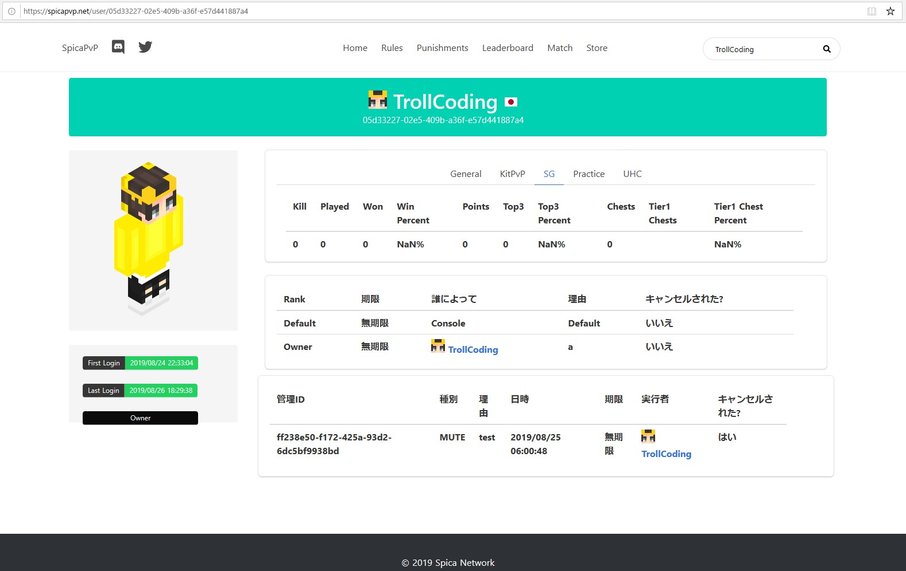

##作ったもの
FrontEnd(Nuxt.js) + Backend(Kotlin) + Database(MongoDB)\
↓\
Hosting(Firebase) + CDN(Cloudflare)\
↓\
https://spicapvp.net

Databaseに格納してあるプレイヤーデータと連動していい感じ

時間がないのでBulmaでStylingしました

##仕組み
* FrontEnd: AxiosでBackend側にRoutingした通りにGet Requestを送る
* Backend: Get Requestを受け取ったらRouting毎にプログラムした処理通りに、データベースから必要な情報だけを取り出してJsonでRespondする

##Nuxt.jsを使った理由
* Vue.jsの知識があれば書ける
* ディレクトリ構造に従った自動ルーティングをしてくれるので手間が省けて効率的
* ネストの動的ルーティングが楽
* 一括でSSRを実現できる

「Vue.jsよりも便利」

今回の場合はKotlinのほうが書きやすいと判断したので、ServerSideはKtorで構築しました

##初めてKtorでサーバーサイドを書いた感想
[Ktorとは](https://ktor.io/quickstart/generator.html#) 
JetBrains社が開発した、Kotlinでサーバーサイドとクライアントサイドを書けるWebフレームワークです

####便利だと思った部分
* Kotlinで書ける
* モダンな文法が多くて可読性の高いコードが書ける。
* KotlinとかJavaのライブラリをそのまま使える

今度書くときはNuxt.jsのSSRを使ってみたいと思います

